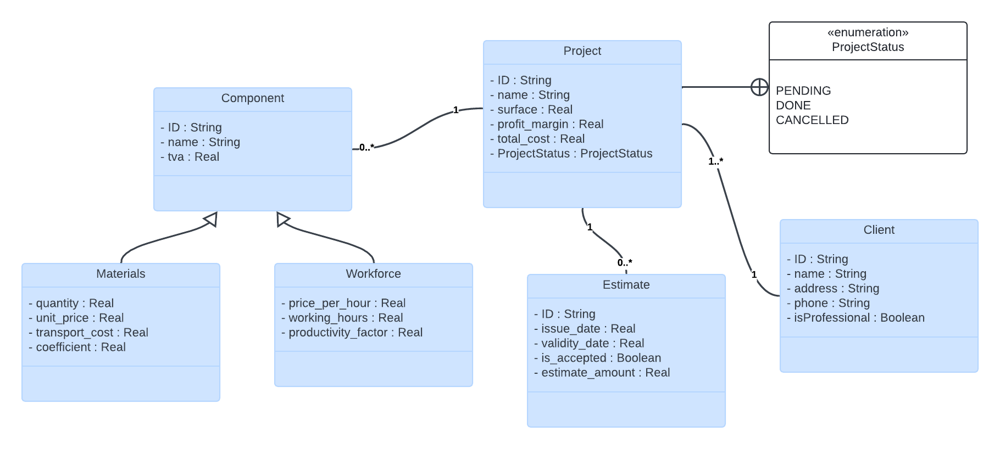

# BatiCuisine

BatiCuisine is a Java application designed for professional kitchen builders and renovators. The application calculates the total cost of the work, taking into account the materials used and the cost of labor, the latter billed by the hour.

## CLass Diagram : 

